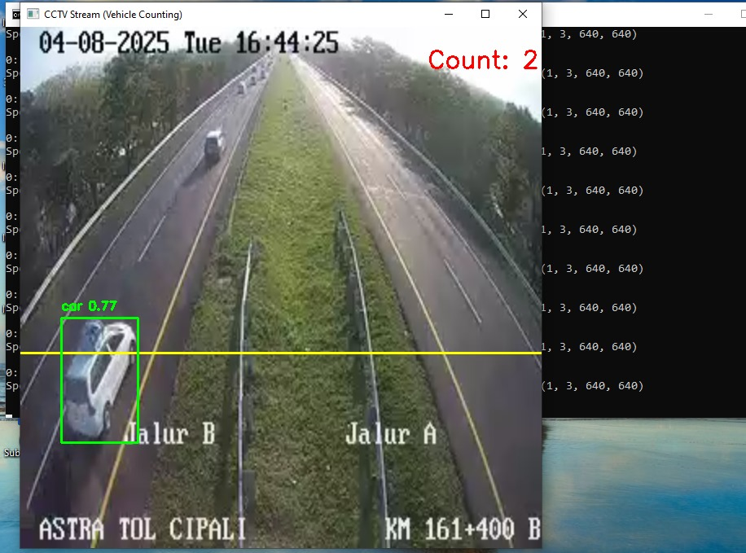

# 🚗 Penghitungan Kendaraan Real-Time dari CCTV Lalu Lintas menggunakan YOLOv8

Proyek ini merupakan sistem pendeteksian dan penghitungan kendaraan secara **real-time** dari siaran langsung CCTV arus lalu lintas milik **Kementerian Perhubungan Republik Indonesia (Kemenhub)**.  
Sistem ini memanfaatkan model deteksi objek **YOLOv8** untuk mengenali kendaraan tertentu yang melintasi garis virtual dalam frame video, lalu menghitungnya secara otomatis.




---

## 📌 Fitur Utama

- Deteksi dan penghitungan kendaraan secara real-time dari stream CCTV berbasis HLS
- Fokus pada jenis kendaraan tertentu: **mobil (car)**, **truk (truck)**, dan **bus**
- Menggunakan model **YOLOv8 varian large (YOLOv8l)** secara default
- Mendukung pemrosesan di **CPU maupun GPU (jika tersedia)**
- Visualisasi bounding box dan perhitungan langsung di layar
- Logika hitung berdasarkan lintasan **garis virtual**

---

## 🧠 Informasi Model

Secara default, proyek ini menggunakan model **YOLOv8l (large)** dari Ultralytics yang menawarkan akurasi tinggi, cocok untuk kasus lalu lintas padat.  
Namun, pengguna dapat memilih varian model lain sesuai kebutuhan perangkat dan performa:

- [YOLOv8n (nano)](https://docs.ultralytics.com/models/yolov8/#yolov8n-nano)
- [YOLOv8s (small)](https://docs.ultralytics.com/models/yolov8/#yolov8s-small)
- [YOLOv8m (medium)](https://docs.ultralytics.com/models/yolov8/#yolov8m-medium)
- [YOLOv8x (extra large)](https://docs.ultralytics.com/models/yolov8/#yolov8x-extra-large)

👉 Lihat selengkapnya di: [Ultralytics Model Zoo](https://docs.ultralytics.com/models/overview/)

---

## 📹 Sumber Stream CCTV

Sumber stream default yang digunakan berasal dari Kemenhub: https://mitradarat-vidstream.kemenhub.go.id//stream//KM160AKM160A//stream.m3u8

jika ingin mengganti url dengan tampilan cctv lainnya, bisa diganti dengan mencari url disini : https://mudik.kemenhub.go.id/cctv

---

## 🛠️ Kebutuhan Sistem

- Python >= 3.8
- PyTorch
- OpenCV
- Ultralytics (YOLOv8)

---

## 📦 Instalasi

```
# Clone repositori
git clone https://github.com/harunid12/CCTV-vehicle_counter.git
cd vehicle-counting-yolov8

# Install dependensi
pip install torch torchvision torchaudio
pip install opencv-python ultralytics

---

## 🚀 Cara Menjalankan
```
python stream_detection.py


## Kontak

Jika ada pertanyaan atau saran, hubungi : [ahmadharun.jambi@gmail.com](mailto:ahmadharun.jambi@gmail.com)


